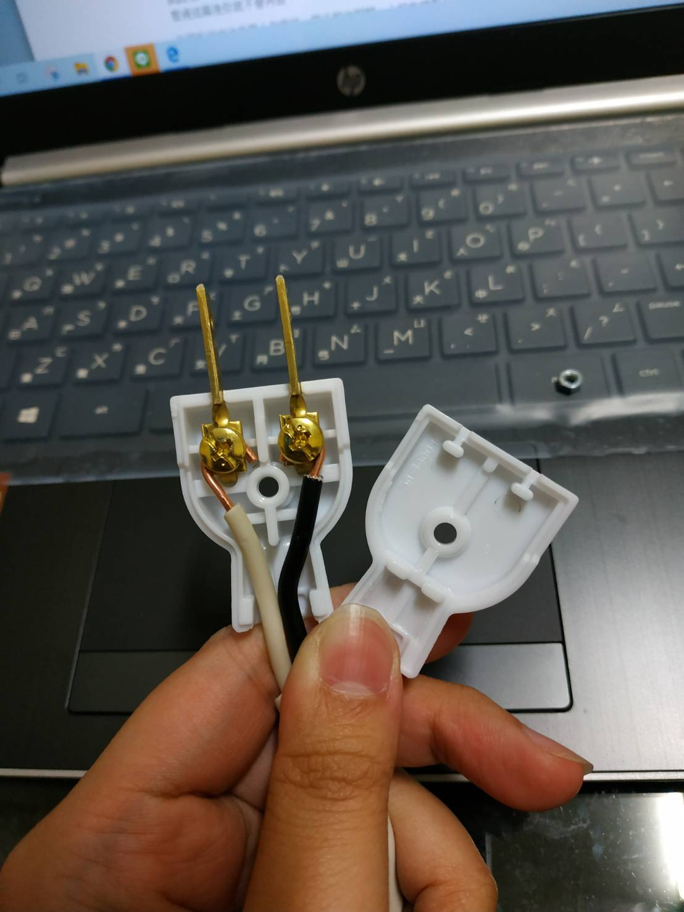
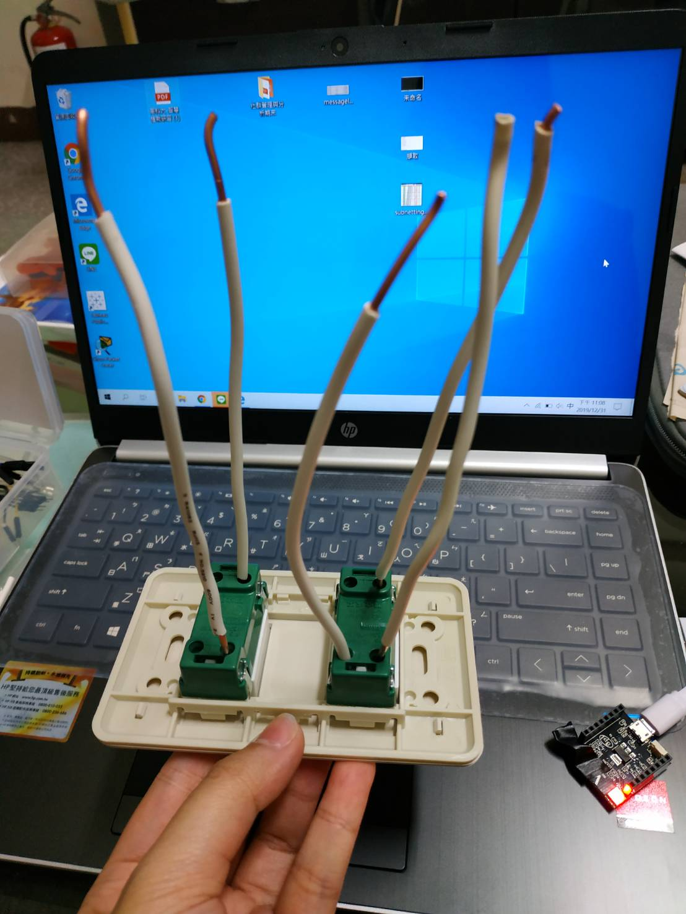
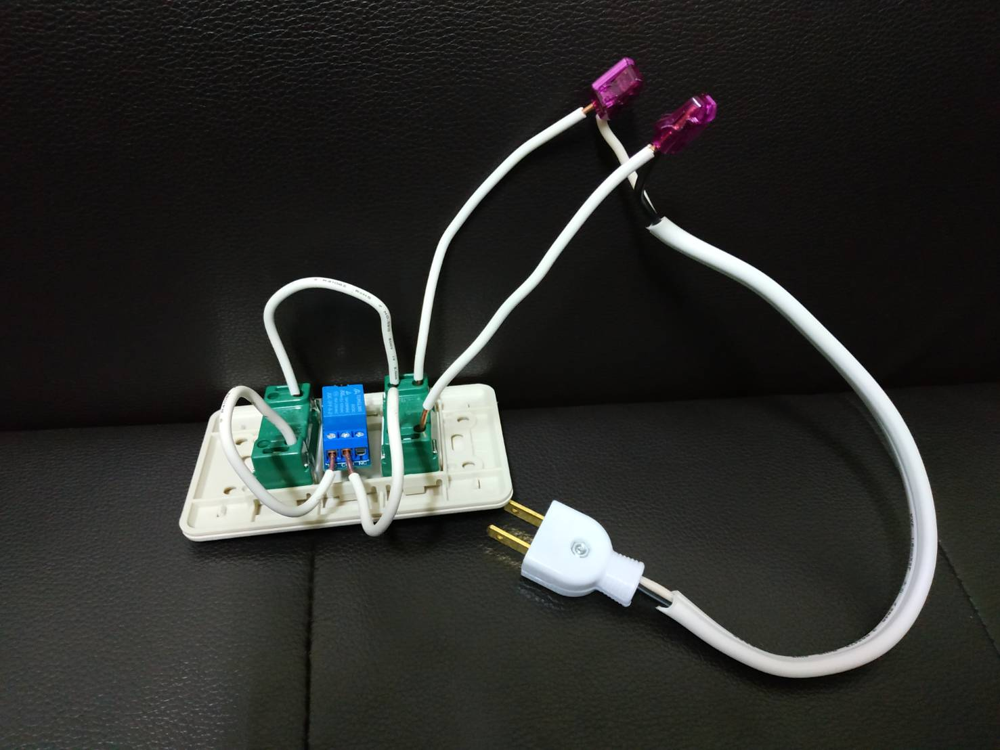

# 智慧插座
#### 課程:跨領域微學分
#### 指導教授:黃文楨
#### 業師:陳又鳴
#### 組員:
#### 0624057 呂佳恩 
#### 0624062 鄭捷予
#### 0624088 張采崴

### 參考範本

### 目的:
做出一個能夠被聲控的智慧插座，只要喊開或關就可以控制插頭是否通電。

### 所需材料:
單心線、雙絞線、雙孔插座組、繼電器、插頭、快速接頭、webduino smart開發板、杜邦線

### 所需工具:
老虎鉗、剪線器、螺絲起子

### 步驟:
1. 先將單心線剪成五段，並去頭尾的皮、雙絞線去皮將裡面的兩條線分開並去皮
2. 插座放入五根單心線
3. 組合插頭與電線，將電線鎖到插頭上即可
4. 把單心線和電線，用快速接頭連接，同時也把單心線接到繼電器上面
5. 繼電器的另一側用杜邦線接出來
6. 和開發板連線
7. 撰寫程式

### 過程實照

### 實作影片

